# PNG test images 202105 README

Created to test [AVIF](https://netflixtechblog.com/avif-for-next-generation-image-coding-b1d75675fe4) & maybe [JpegXL](https://cloudinary.com/blog/tag/JPEG-XL) formats in browsers.

All images are 400x400; large enough to visualize quality, but fast to process.  Filesizes shrank with [FileOptimizer](https://nikkhokkho.sourceforge.io/static.php?page=FileOptimizer).

[filelist.txt](filelist.txt) is a plain listing of all image filenames to help with scripts.

File prefixes are flags for content-types, as described below:

## cs
Color Swatch: color-hex

Programmically created as SVGs.  Colors include **F** RGB values, grays, [Fitzpatrick skin phototypes](https://en.wikipedia.org/wiki/Fitzpatrick_scale) ([6 color scale](https://sts.doit.wisc.edu/manuals/photoshop2-retouching/images/st-guide.png)), subdued pastels, [Manchester Color Wheel](https://www.ncbi.nlm.nih.gov/pmc/articles/PMC3008688/) (early version) & 4 bonus colors.

#### [cs-black-000.png](cs-black-000.png)
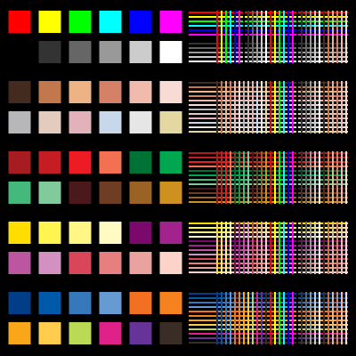

#### [cs-blue-00f.png](cs-blue-00f.png)
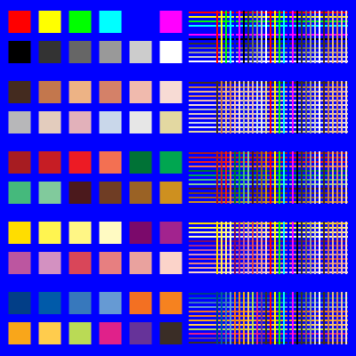

#### [cs-cyan-0ff.png](cs-cyan-0ff.png)
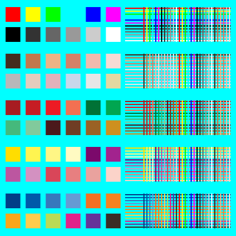

#### [cs-gray-7f7f7f.png](cs-gray-7f7f7f.png)
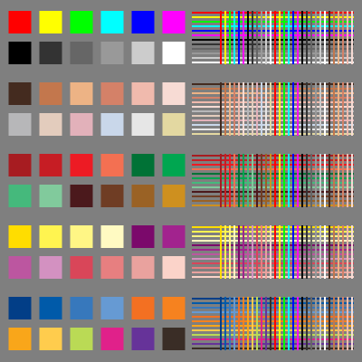

#### [cs-green-0f0.png](cs-green-0f0.png)
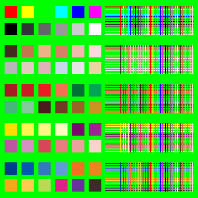

#### [cs-purple-f0f.png](cs-purple-f0f.png)
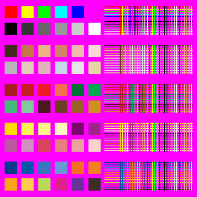

#### [cs-red-f00.png](cs-red-f00.png)
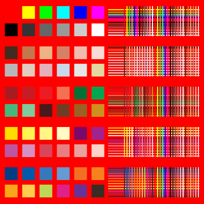

#### [cs-white-fff.png](cs-white-fff.png)
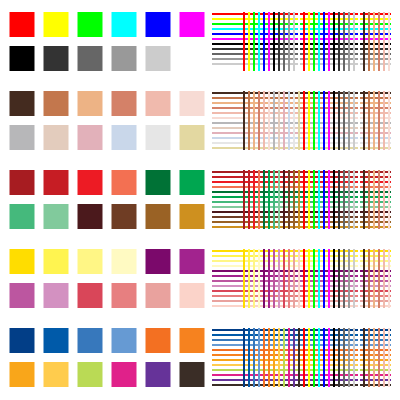

#### [cs-yellow-ff0.png](cs-yellow-ff0.png)
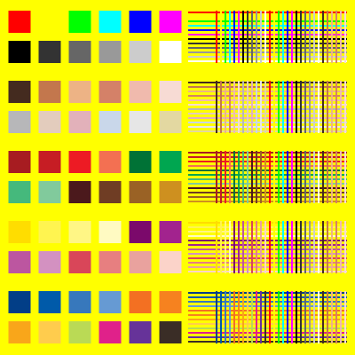

## ia

Illustration / Art

#### [ia-forrest.png](ia-forrest.png)
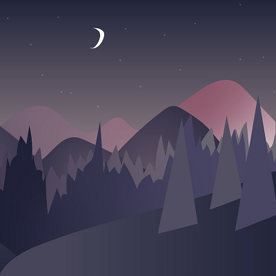

* src: [pixabay](https://pixabay.com/illustrations/forest-mountains-night-sky-5375005/)
* author:_Namfon_/Sasimaporn Moonthep
* license: "Free for commercial use, No attribution required"

#### [ia-installing.png](ia-installing.png)

* src: [illlustrations.co](https://illlustrations.co)
* author: vijay verma
* licence: MIT "completely free and use these to design awesome - landing pages, mobile app or presentations"

## pg

Photograph

#### [pg-coral.png](pg-coral.png)
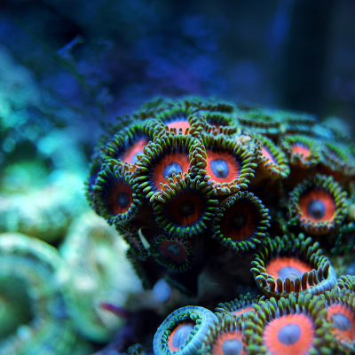

* src: [pixabay](https://pixabay.com/photos/coral-reef-sea-underwater-water-2694453/)
* author: otakphoto/Marcelo Kato | Japan/Brazil
* license: "Free for commercial use, No attribution required"

#### [pg-couplevn.png](pg-couplevn.png)

* src: [unsplash](https://unsplash.com/photos/Kou1TDS4b_c)
* author: Hưng Nguyễn | Ha Noi, Viet Nam
* license: unsplash "Commercial and non-commercial purposes"

 ## web

 Various websites, caputured 2021-04, 400px browser width.  Filename = domain name.

#### [web-booking.png](web-booking.png)
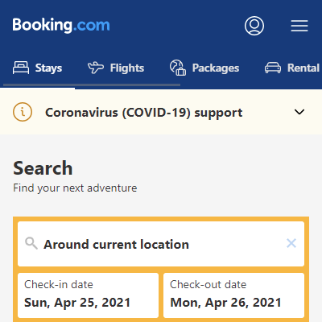

#### [web-braverangels.png](web-braverangels.png)
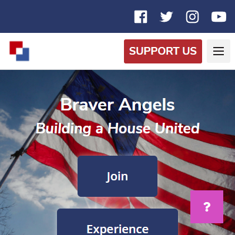

#### [web-jakearchibald.png](web-jakearchibald.png)
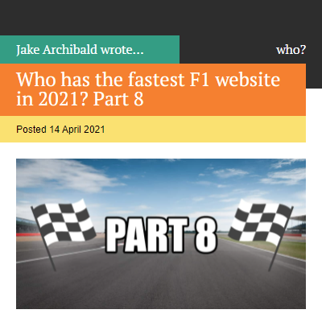

#### [web-surma.png](web-surma.png)
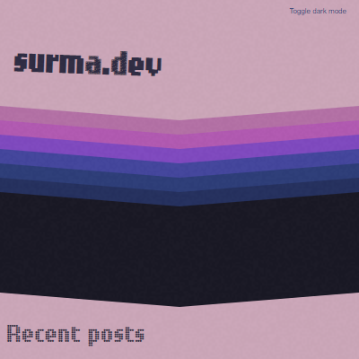